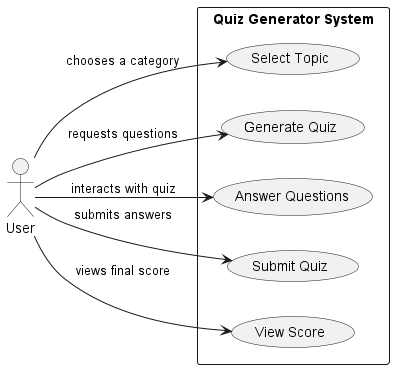
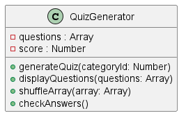
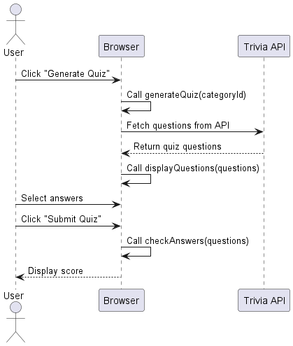
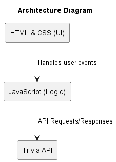
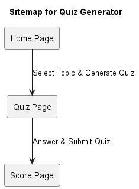
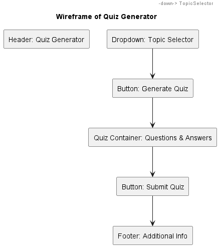

# Quizerator

## Quiz Generator Diagrams

Below are the diagrams for the Quiz Generator project. 
### Use-Case Diagram

[Download Use-Case Diagram](QuizGenerator/uml-diagrams/diagrams/UseCaseDiagram.png)

### Class Diagram

[Download Class Diagram](QuizGenerator/uml-diagrams/diagrams/ClassDiagram.png)

### Sequence Diagram

[Download Sequence Diagram](QuizGenerator/uml-diagrams/diagrams/SequenceDiagram.png)

### Architecture Diagram

[Download Architecture Diagram](QuizGenerator/uml-diagrams/diagrams/ArchitectureDiagram.png)

### Sitemap Diagram

[Download Sitemap Diagram](QuizGenerator/uml-diagrams/diagrams/SitemapDiagram.png)

### Wireframe Diagram

[Download Wireframe Diagram](QuizGenerator/uml-diagrams/diagrams/WireframeDiagram.png)
